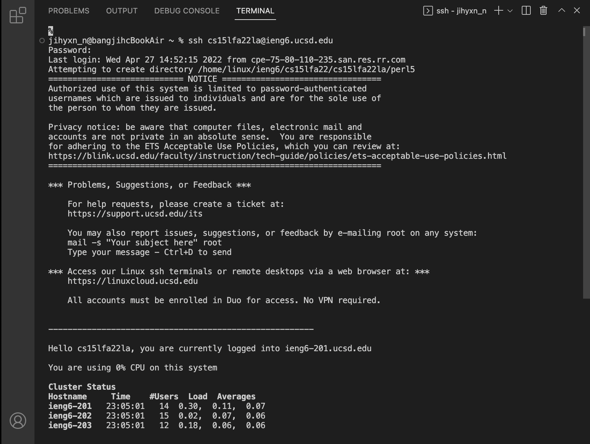
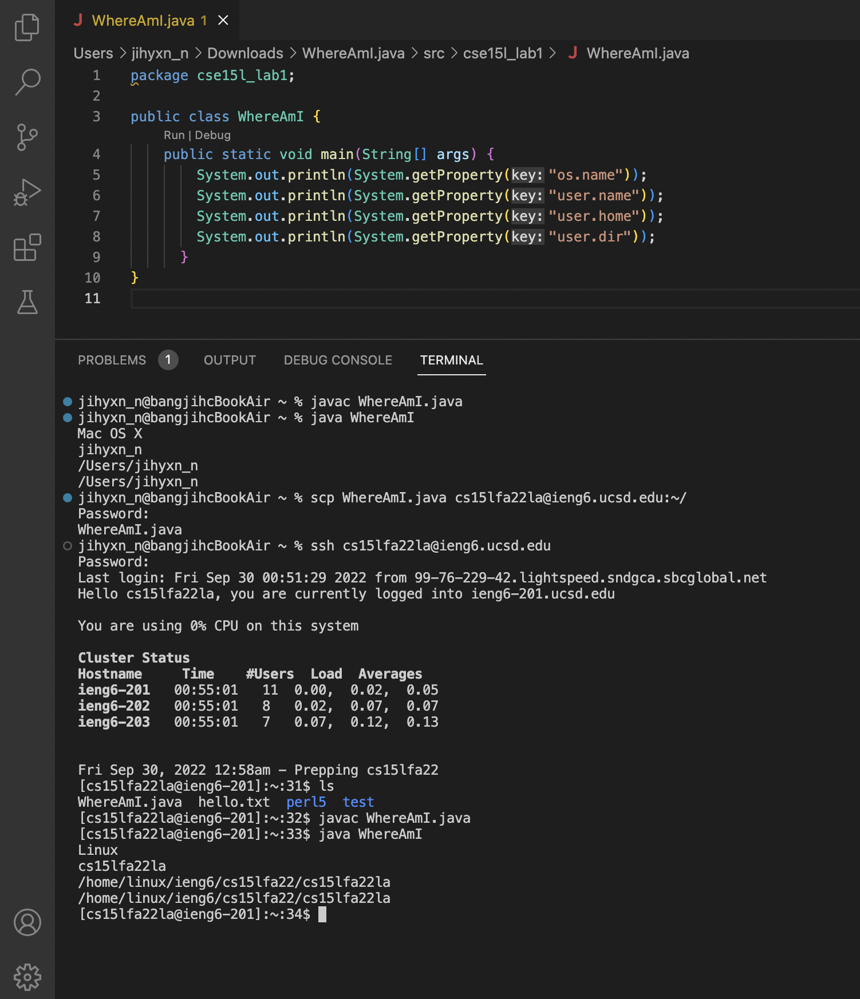
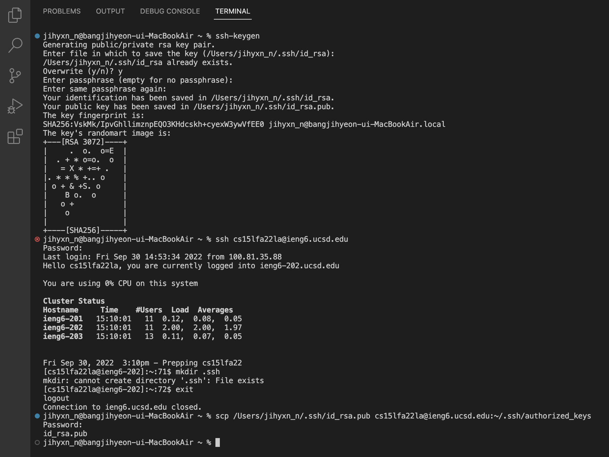

## CSE15L Lab 1: Remote Access

### **1. Installing VScode**

> * Visit https://code.visualstudio.com/.
> * Click the download button and install VScode.

### **2. Remotely Connecting**

> * Type "ssh csq5lfa22zz@ieng6.ucsd.edu," but replace zz with your own course-specific account letters.
> * Type the password for course-specific account.
> * Wait for a few seconds to let the computer (client) connect to a computer in the CSE basement (server).

### **3. Trying Some Commands**

> * Type and run the commands of "cd ~", "cd", "ls -lat", "ls -a", "cat /home/linux/ieng6/cs15lfa22/public/hello.txt", "cp /home/linux/ieng6/cs15lfa22/public/hello.txt ~", "pwd", "mkdir test", "ls", "cp".
> * I posted two pictures, first from my own computer after ssh-ing, and second from the computer on the CSE basement after ssh-ing. I should have take a screenshot for the commands running on my computer (before ssh-ing) for the second one. **At this time, I had misunderstood the lab prompt by understanding that I need to take a screenshot of running the commands on the basement computer.** After I understood the lab prompt correctly, I already finished the part 7, so I don't know how to undo and disconnect my computer to the server (I tried "exit" command to log out, but it didn't work). However, I have run the commands on my computer (before ssh-ing), and seen some of the commands got an errors before.

### **4. Moving Files with scp**

> * Create a file called "WhereAmI.java" and write the code above. Then, run the file using "javac WhereAmI.java" and "java WhereAmI" commands.
> * Using "scp" command to work remotely by copying files back and forth between the computers, type "scp WhereAmI.java cs15lfa22zz@ieng6.ucsd.edu:~/" in the terminal from the directory where we made this file to run the command. Then, log into ieng6 using "ssh" commands and type "ls." After this process, you can run the program on the ieng6 computer. Run "javac WhereAmI.java" and "java WhereAmI" commands again to check it.
> * In this part, I had some errors giving me the message that the file is non-projectile. This error has been resolved by making a package and crating the file into the src. Also, I could run this class after I disconnected the server from my computer.

### **5. Setting an SSH Key**

> * Not to type our password everytime we log in or run "scp," we have to use "ssh keys."
> * Type "ssh-keygen." Then, enter the file path were you want to save the key (just tap enter to easily enter the file path) and enter any passphrase you want.
> * This process create two new files, the private key in a file id-rsa and the public key in a file id_rsa.pub stored in the .ssh directory on your computer.
> * Then, using "ssh" command to log into the server, and type "mkdir .ssh," and log out using "exit" command.
> * Then, type "scp /Users/jihyxn_n/.ssh/id_rsa.pub cs15lfa22zz@ieng6.ucsd.edu:~/.ssh/authorized_keys" to enable ssh or scp from the client to the server without entering the password.
> * When I typed "mkdir .ssh," the terminal said that the computer cannot create directory '.ssh' because the file already exist. I'm confused how this error came up. Also, the lab prompt said that I need to type "scp /Users/jihyxn_n/.ssh/id_rsa.pub cs15lfa22@ieng6.ucsd.edu:~/.ssh/authorized_keys," but this command did not work without my course specific account password. So I used "scp /Users/jihyxn_n/.ssh/id_rsa.pub cs15lfa22zz@ieng6.ucsd.edu:~/.sshauthorized_keys" instead of what the prompt said, and the password worked.

### **6. Optimizing Remote Running**

> * Use "ssh cs15lfa22zz@ieng6.ucsd" "ls" and "cp WhereAmI.java OtherMain.java; javac OtherMain.java; java WhereAmI" to check the remote server can run the "WhereAmI.java" file.
> * This worked for my computer.

 

