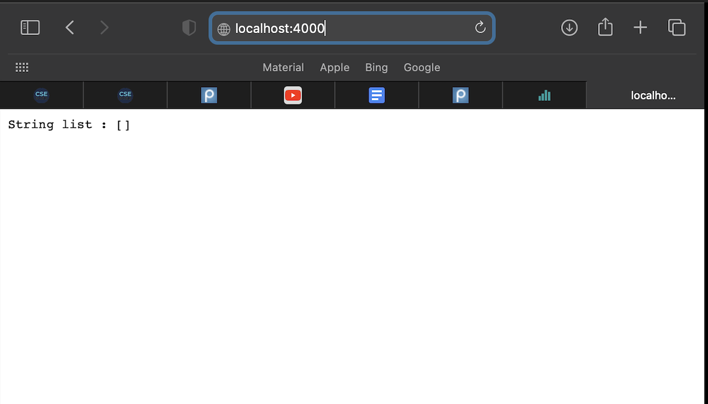
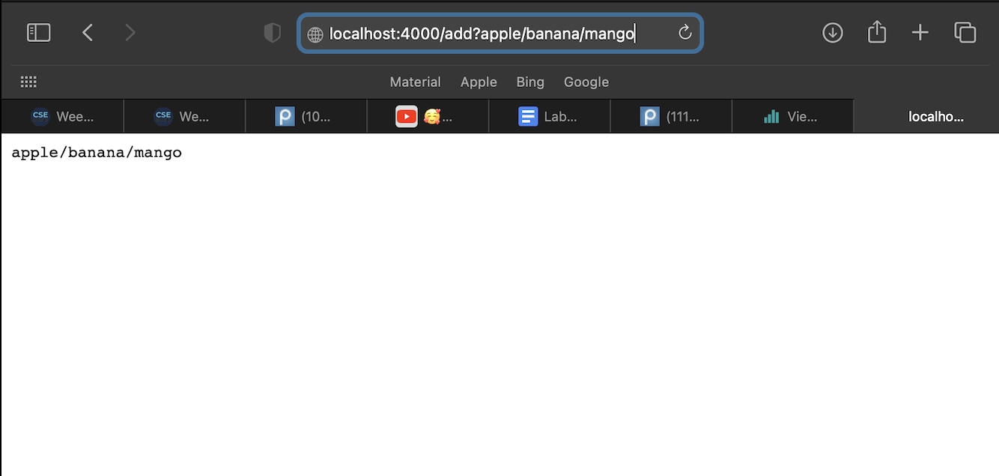
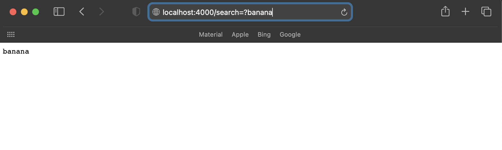

## CSE15L Lab 3: Week 3 Lab Report

### **Part 1**

```
class Handler implements URLHandler {
    public String handleRequest(URI url) {
        ArrayList<String> search = new ArrayList<String>();
        String result = null;
        if (url.getPath().equals("/")) {
            return String.format("String list : " + search);
        } else if (url.getPath().equals("/add")) {
            url.getQuery();
            return String.format(url.getQuery());
            /*for(int i = 0; i < search.size();){
                return String.format("The list is: ", search.get(i));
            }*/
        } else {
            System.out.println("Path: " + url.getPath());
            if (url.getPath().contains("search")) {
                String[] parameters = url.getQuery().split("=");
                for(int i = 0; i < parameters.length; i++){
                    if(parameters[i] == url.getQuery()){
                        result = parameters[i];
                    }
                }
                }
            }
            return result;
            //return "404 Not Found!";
        }
    }
```
> * For the base window, the method "getPath()" and "String.format() are used. "getPath()" method returns the path of "url", and "String.format()" method help show the return value on the website. At this time, the url browser shows the empty array. 
> * One of the values for the relevant arguments to "getPath()" is the argument "/." Using "getPath" method, we can notice if the path of "url" has "/". Since the path of "url" was equals to "/", the first window shows the empty ArrayList called "search." 
> * If the value of "/" changes to other String value, the code would work and the browser shows the same first window only if the path of "url" has that exact String value.

---



```
class Handler implements URLHandler {
    public String handleRequest(URI url) {
        ArrayList<String> search = new ArrayList<String>();
        String result = null;
        if (url.getPath().equals("/")) {
            return String.format("String list : " + search);
        } else if (url.getPath().equals("/add")) {
            url.getQuery();
            return String.format(url.getQuery());
            /*for(int i = 0; i < search.size();){
                return String.format("The list is: ", search.get(i));
            }*/
        } else {
            System.out.println("Path: " + url.getPath());
            if (url.getPath().contains("search")) {
                String[] parameters = url.getQuery().split("=");
                for(int i = 0; i < parameters.length; i++){
                    if(parameters[i] == url.getQuery()){
                        result = parameters[i];
                    }
                }
                }
            }
            return result;
            //return "404 Not Found!";
        }
    }
```
> * For the path supporting to add a new string to the list, I called the methods 
"getPath()" and "getQeury()." "getPath" method is the method returning the path of url as I said above, and "getQuery()" is for returning the query of url. 
> * The value of the relevant argument to "getPath()" and "getQeury()" methods is "/add." Since we add a new String value using the path, the code returns the String value on the browser using "getQuery" method if the "url" path from the parameter contains the new String value along the String "/add", checked by "getPath()" method.
> * If the value "/add" changes to another String value of argument, the code would work if we type the exact value in the search tap. 


---



```
class Handler implements URLHandler {
    public String handleRequest(URI url) {
        ArrayList<String> search = new ArrayList<String>();
        String result = null;
        if (url.getPath().equals("/")) {
            return String.format("String list : " + search);
        } else if (url.getPath().equals("/add")) {
            url.getQuery();
            return String.format(url.getQuery());
            /*for(int i = 0; i < search.size();){
                return String.format("The list is: ", search.get(i));
            }*/
        } else {
            System.out.println("Path: " + url.getPath());
            if (url.getPath().contains("search")) {
                String[] parameters = url.getQuery().split("=");
                for(int i = 0; i < parameters.length; i++){
                    if(parameters[i] == url.getQuery()){
                        result = parameters[i];
                    }
                }
                }
            }
            return result;
            //return "404 Not Found!";
        }
    }
```
> * For the path supporting for querying the list of strings and returning a list of all strings that have a given substring, I called the methods "getPath()" and 
"getQuery()" to get the path and query for the "url."
> * The value of the relevant argument to the methods is "search." In this code, we check the path of "url" from the parameter of handleRequest(URL url) method using "getPath()" to see if it contains the String "search." If yes, we also check if the "parameters" that we are looking for is in the query of "url". If the query of "url" contains the "parameters", the code returns the value of parameter that we searched. For example, if I want to search the String value "banana" after I added the list of Strings "apple/banana/mango," I can search "banana" using "localhost:4000/search=?banana".
> * If the value changes to another String value, the code should work if we type the changed value in the search tap.


---


### **Part 2**

```
  static double averageWithoutLowest(double[] arr) {
    if(arr.length < 2) { return 0.0; }
    double lowest = arr[0];
    for(double num: arr) {
      if(num < lowest) { lowest = num; }
    }
    double sum = 0;
    for(int i = 0; i < arr.length; i++){
      sum += arr[i];
    }
    sum = sum - lowest;
    return sum / (arr.length - 1);
  }
```
```
  @Test
  public void testAverage(){
    double[] input1 = {6, 4, 2, 8, 4};
    double exp = 5.5;
    double actual = ArrayExamples.averageWithoutLowest(input1);
    assertEquals(exp, actual, 0.001);
  }
```

> * For "averageWithoutLowest(double[] arr)" method in ArrayExample.java, the failure-inducing inputs in testAverage() in ArrayTests.java are the test code only having one element in the array and the test code which didn't have duplicated elements. 
> * The symptom was AssertionError because the code removes all the numbers equal to the lowest number when it should just leaves out only one. **(I got the actual assertion error before I got the another assertion error shown in the screenshot.)** 
> * The bug was on the line 8 to 11 in the averageWithoutLowest(double[] arr) method above. Since the original code removes all the values same as the lowest, I just added all the elements in the array and divide the sum by arr.length - 1 after I subtract the lowest number from the sum.
> * Since the symptom shows that my assertion on the test is wrong because the bug causes the wrong actual value by removing more than one value. 


---


```
static List<String> merge(List<String> list1, List<String> list2) {
    List<String> result = new ArrayList<>();
    int index1 = 0, index2 = 0;
    while(index1 < list1.size() && index2 < list2.size()) {
      if(list1.get(index1).compareTo(list2.get(index2)) < 0) {
        result.add(list1.get(index1));
        index1 += 1;
      }
      else {
        result.add(list2.get(index2));
        index2 += 1;
      }
    }
    while(index1 < list1.size()) {
      result.add(list1.get(index1));
      index1 += 1;
    }
    while(index2 < list2.size()) {
      result.add(list2.get(index2));
      index1 += 1;
      index2++;
    }
    return result;
  }
```
```
@Test
public void testMerge(){
    List<String> list1 = new ArrayList<>(Arrays.asList("a", "b", "c", "d"));
    List<String> list2 = new ArrayList<>(Arrays.asList("e", "f", "g"));
    List<String> output = new ArrayList<>(Arrays.asList("a", "b", "c", "d", "e", "f","g"));
    assertEquals(output, ListExamples.merge(list1, list2));
}
```

> * For the "merge() method" in ListExamples.java, the failure-inducing inputs in testMerge() in ListsTests.java are the test code having different output order from the actual output and the test code having no elements in list2.
> * The sympton was java.lang.OutOfMemoryError, which occurs when java heap has limited memory at that moment.
> * In line 21 in the merge() method code above, we need to increment index2 by index2++ because the code never stop under the condition of index2 < list2.size().
> * Since the bug produces the non-stopping code, it causes the symptom of java.lang.OutOfMemoryError. 