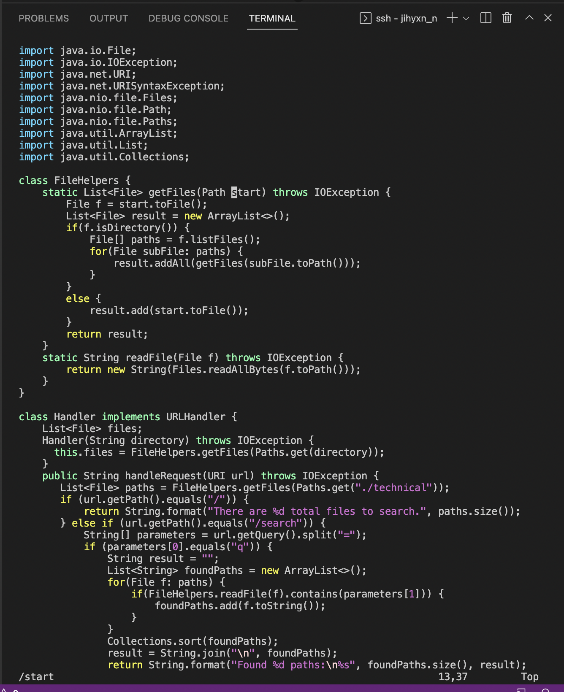
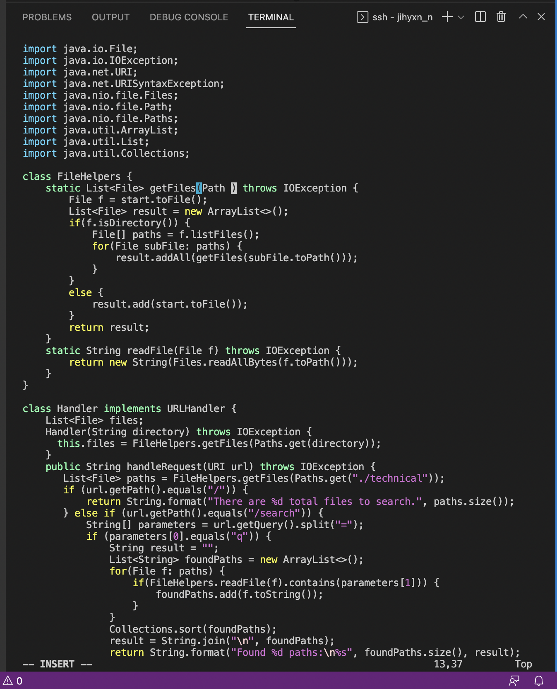
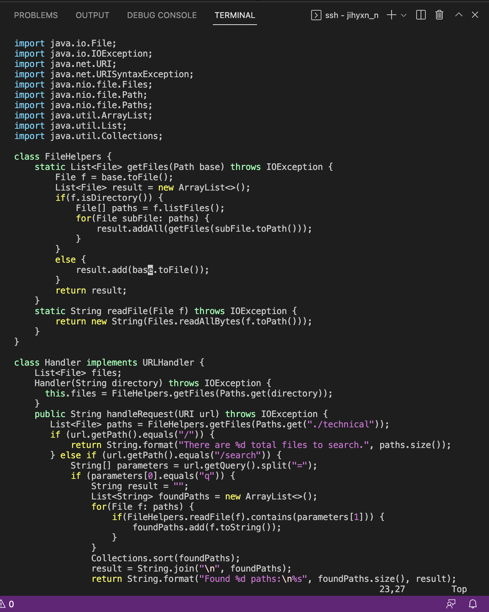
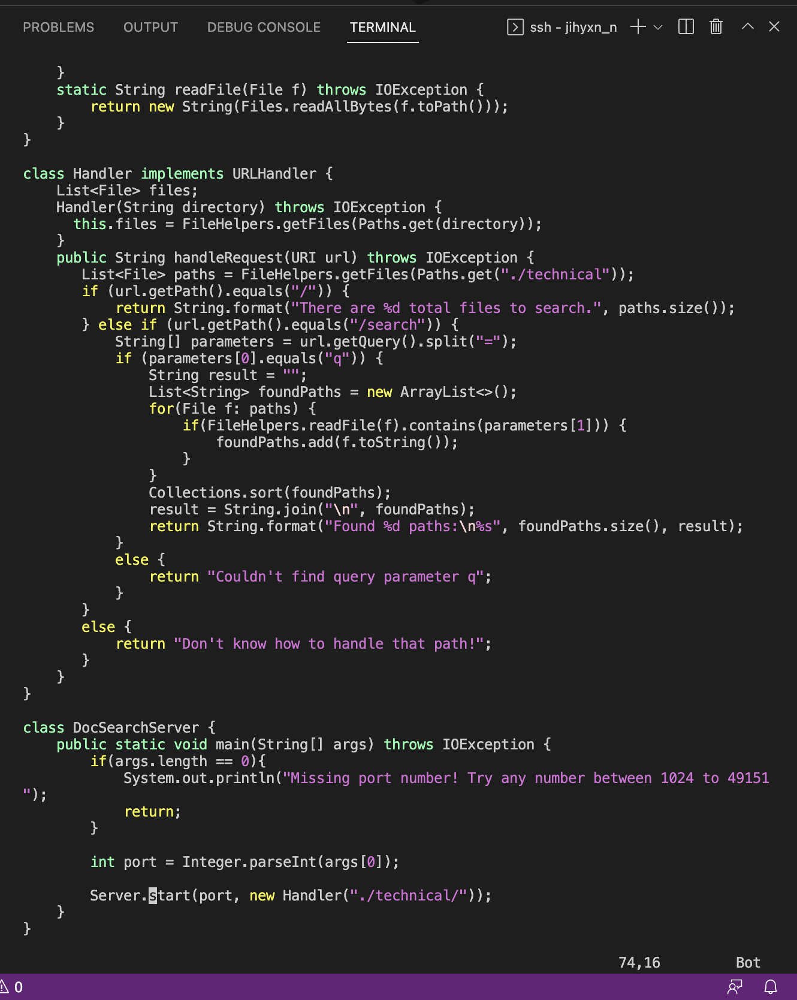
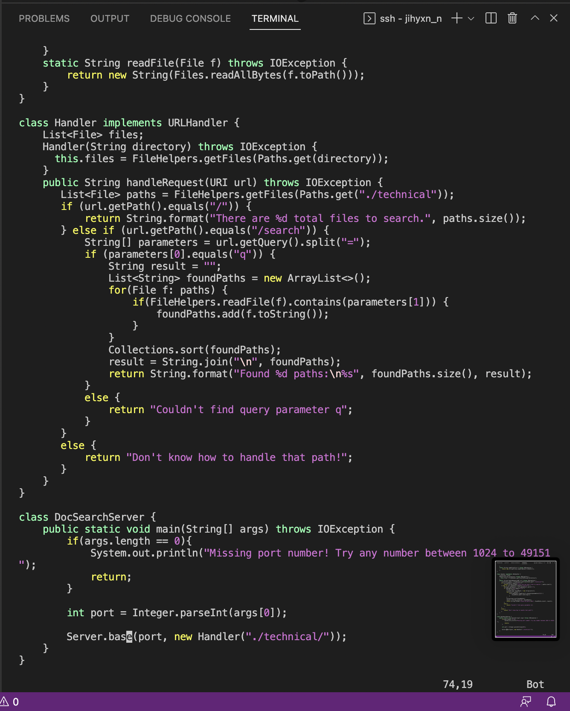
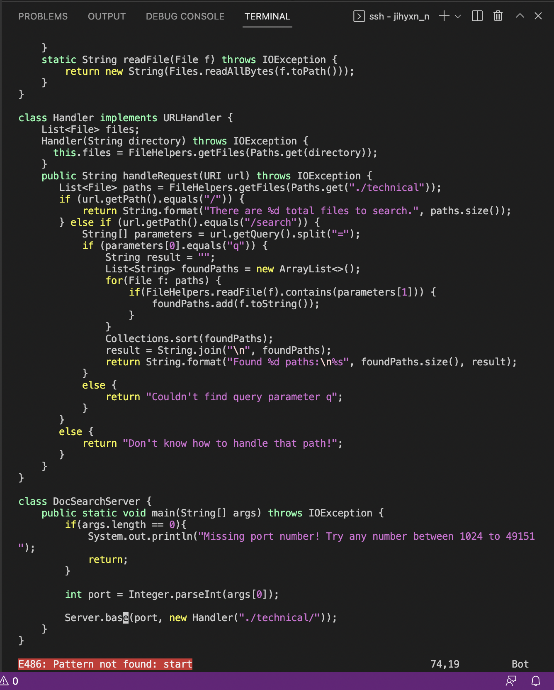
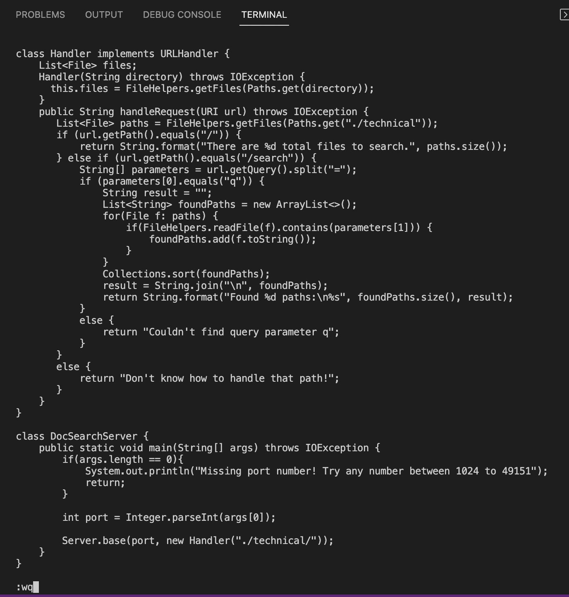

## CSE15L Lab 4: Week 7 Lab Report

### **Part 1**
To give the shortest sequence of vim commands for changing the name of the "start" parameter and its uses to "base", I used ```/start<Enter><c><g><n>base<esc><n><.><esc><n><.><esc><n><.><esc><n><:><w><q>``` 


> * Type ```/start<Enter>``` to search the word "start" and move to the cursor to the word.  


> * Type ```<c><g><n>``` to delete the word "start".  


> * Type ```base```.  


> * Type ```<esc><n>``` to exit the insert mode and find the next "start".  


> * Type ```<.>``` to repeat the last change.   


> * Type ```<esc><n>``` to exit the insert mode and find the next "start".  


> * Type ```<.>``` to repeat the last change.  


> * Type ```<esc><n>``` to exit the insert mode and find the next "start".  


> * Type ```<.>``` to repeat the last change.  


> * Type ```<esc><n>``` to exit the insert mode and find the next "start", but in this step, there is no more "start".


> * Type ```<:><w><q>``` to save the changes and exit vim.  


---

### **Part 2**
> * The first method took 86 seconds on the first try and 84 seconds on the second try, and the second method took 57 seconds on the first try and 58 seconds on the second try.
> * In the first method, I copied the file to the remote server with ```scp DocSearchServer.java cs15lfa22la@ieng6.ucsd.edu``` after I edited the DocSearchServer.java file in Visual Studio Code. Then, I ran ```bash test.sh``` to confirm it works. I had no difficulty when I tried this method.
> * In the second method, I logged into the server with ```ssh cs15lfa22la@ieng6.ucsd.edu```. Then, I made the edit for the DocSearchServer.java file in vim. After that, I ran ```bash test.sh``` after I exited vim. Here, I also had no difficulty as well.  


** Questions **
> * I would prefer to the second style. Since I am running the file remotely, I may not able to access the code file directly. If I edit the file in vim, I don't need to directly access the file, so I would prefer to the second style.
> * If I have to make a big change in the long file, I would prefer to using the first style. In the first one, it is easier to move the cursor than in the second one because I can easily move the cursor in VS code rather than in vim. Thus, in the situation that I need to move the cursor frequently to make many edits and write more codes, I would prefer to the fisrt style.


