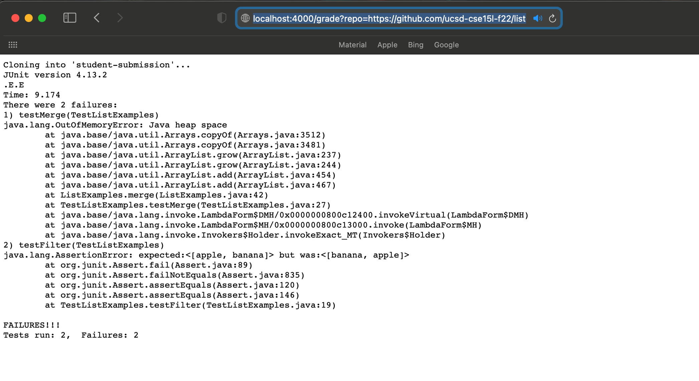
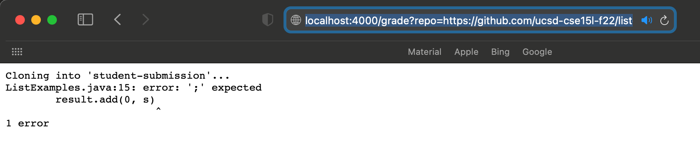
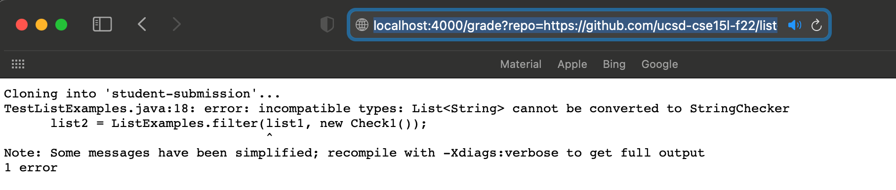

## CSE15L Lab 5: Week 9 Lab Report

**```grade.sh``` code :**
```
set -e
CPATH=".:lib/hamcrest-core-1.3.jar:lib/junit-4.13.2.jar"
rm -rf student-submission
git clone $1 student-submission
cp TestListExamples.java student-submission/
cp -r lib student-submission
cd student-submission

javac -cp $CPATH *.java
java -cp $CPATH org.junit.runner.JUnitCore TestListExamples
```  



> * Student submission of https://github.com/ucsd-cse15l-f22/list-methods-lab3, which has the same code as the starter from lab 3.


> * Student submission of https://github.com/ucsd-cse15l-f22/list-methods-compile-error, which has a syntax error of a missing semicolon.


> * Student submission of https://github.com/ucsd-cse15l-f22/list-methods-signature, which has the types for the arguments of ```filter``` in the wrong order, so it does not match the expected behavior.

