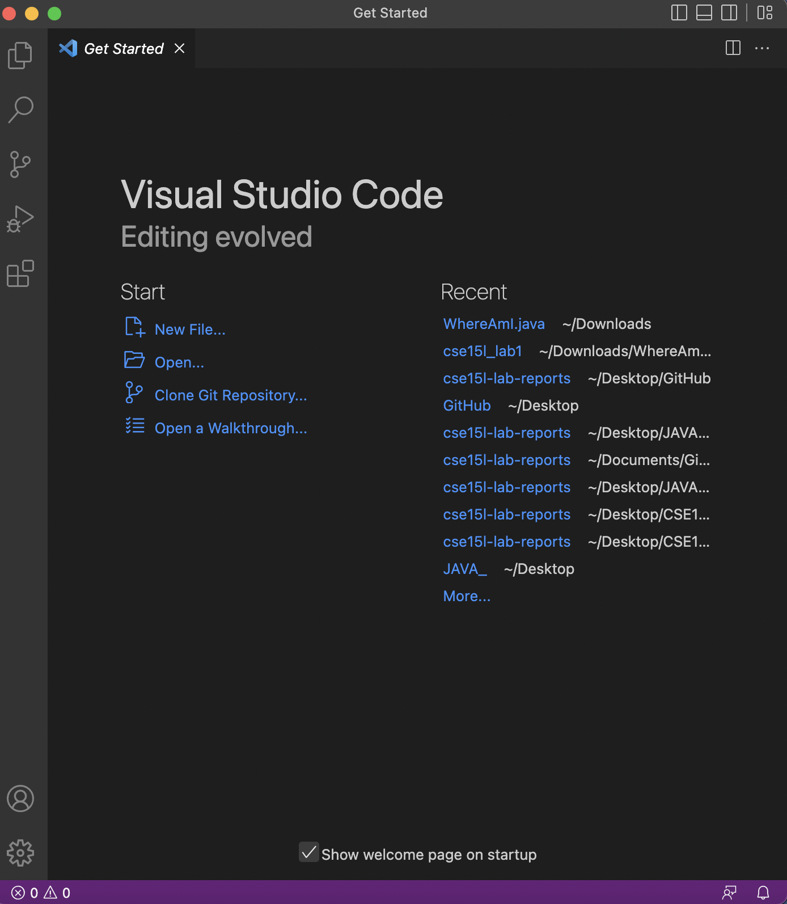
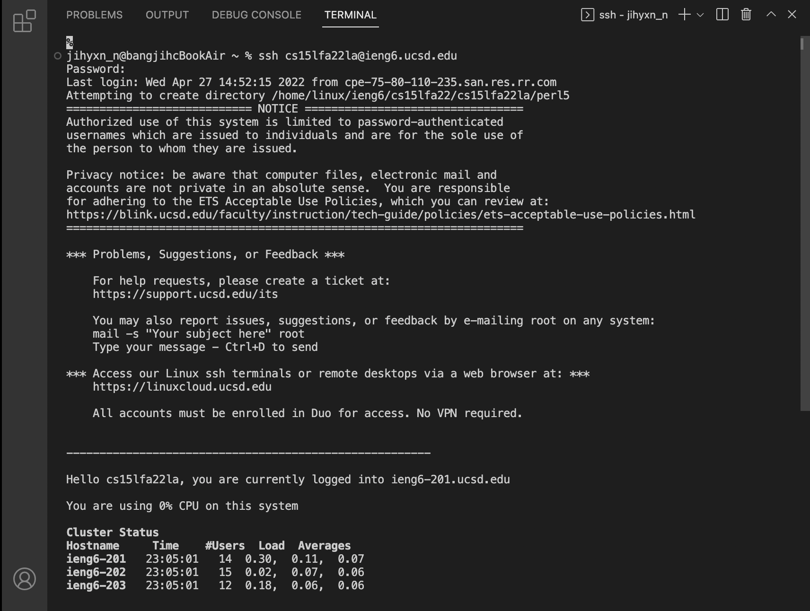
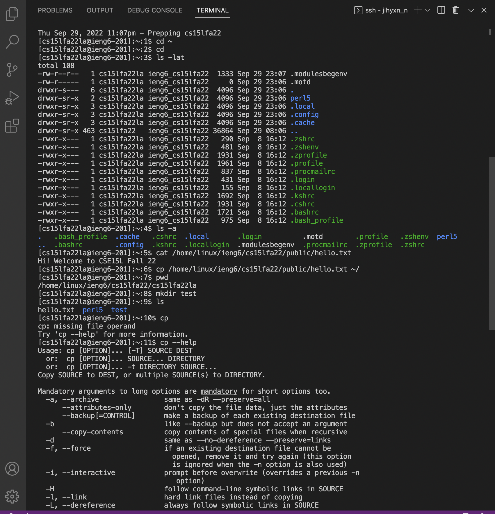
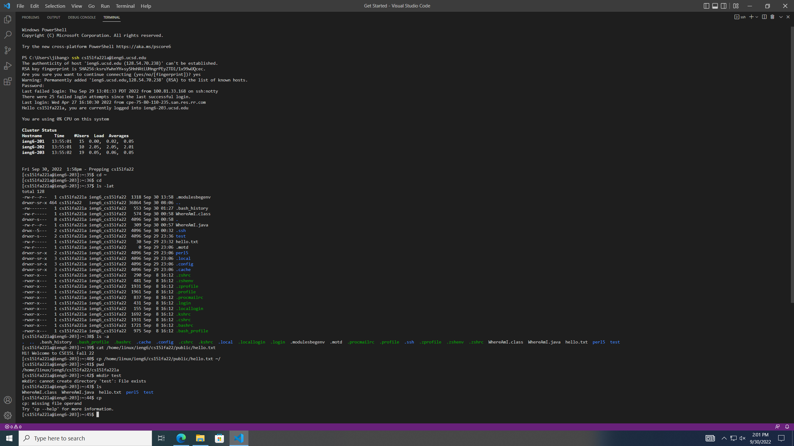

## CSE15L Lab 1: Remote Access
---

### Installing VScode

> * Visit https://code.visualstudio.com/.
> * Click the downlad buttton and install VScode.
---

### Remotely Connecting

> * Type ssh cs15lfa22zz@ieng6.ucsd.edu, but replace zz with your own course-specific account letters.
> * Type your password for course-specific account
> * Wait for a few seconds to let your computer (client) connect to a computer in the CSE basement (server).
---

### Trying Some Commands

> * Type “cd ~” , “cd” , “ls -lat”, “ls -a”, “cat /home/linux/ieng6/cs15lfa22/public/hello.txt” 
