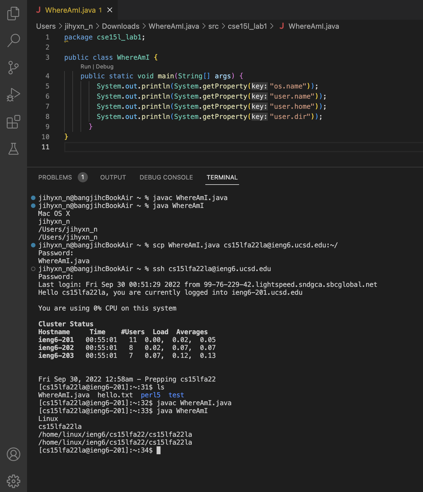
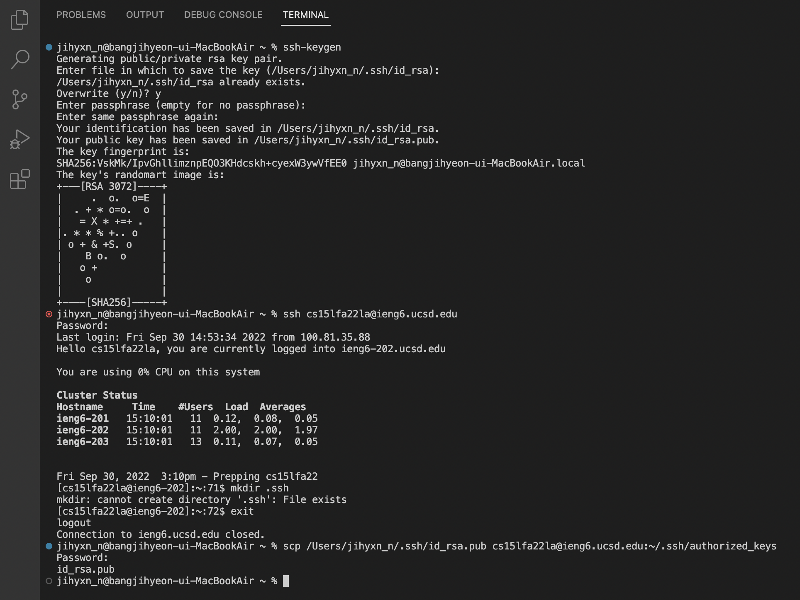
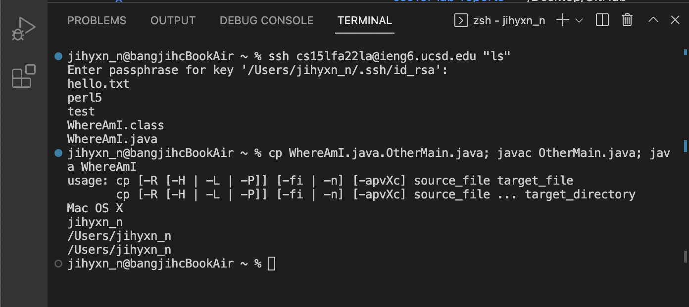

## CSE15L Lab 1: Remote Access

#### **Installing VScode**

> * Visit https://code.visualstudio.com/.
> * Click the downlad buttton and install VScode.

#### **Remotely Connecting**

> * Type ssh cs15lfa22zz@ieng6.ucsd.edu, but replace zz with your own course-specific account letters.
> * Type the password for course-specific account
> * Wait for a few seconds to let the computer (client) connect to a computer in the CSE basement (server).

#### **Trying Some Commands**

> * Type and run the commands of “cd ~” , “cd” , “ls -lat”, “ls -a”, “cat /home/linux/ieng6/cs15lfa22/public/hello.txt”, "cp /home/linux/ieng6/cs15lfa22/public/hello.txt ~/", "pwd", "mkdir test", "ls", "cp".
> * I posted two pictures, first from own computer after ssh-ing, and second from the computer on the CSE basement after ssh-ing. I also should have take a screenshot for the commands running on my computer (before ssh-ing). **At this time, I had misunderstood the lab prompt by understainding that I need to take a screenshot of running the commands on the basement computer.** After I understood the lab prompt correctly, I already finished the part 7, so I don't know how to undo and disconnect my computer to the server. However, I have run the commands on my computer (before ssh-ing), and seen some of the commands got an errors. 

#### **Moving Files with scp**

> * Create a file called WhereAmI.java and write the code above using "javac WhereAmI.java" and "java WhereAmI" commands.
> * Using "scp" to work remotely by copying files back and forth between the computers.
> * In this part, I had some erros giving me the message that the file is non-projectile. This error has been resolved by making a package and creating the file into the src. Also, I could run this class after I disconnected the server from my computer.

#### **Setting an SSH Key**

> * Not to type our password everytime we log in or run scp, we have to use ssh keys.
> * Type "ssh-keygen". Then, enter file to save the key (just tap enter to easily enter the file to save the key) and enter any passphrase you want.
> * This process create two new files, the private key in a file id_rsa and the public key in a file id_rsa.pub stored in the .ssh directory on your computer. 
> * Then, using "ssh" command to log into the server, and type "mkdir .ssh", and log out using "exit" command.
> * Then, type "scp /Users/jihyxn_n/.ssh/id_rsa.pub cs15lfa22zz@ieng6.ucsd.edu:~/.ssh/authorized_keys" to enable ssh or scp from the client to the server without entering the password.
> * When I typed "mkdir .ssh", the terminal said that the computer canot create directory '.ssh' because the file already exists, and I'm confused how this error came up. Also, the lab prompt said that I need to type "scp /Users/jihyxn_n/.ssh/id_rsa.pub cs15lfa22@ieng6.ucsd.edu:~/.ssh/authorized_keys", but this command did not work because my password didn't work. So I used "scp /Users/jihyxn_n/.ssh/id_rsa.pub cs15lfa22zz@ieng6.ucsd.edu:~/.ssh/authorized_keys" instead of what the promt said, the password worked. 

#### **Optimizing Remote Running**

> * Use "ssh cs15lfa22zz@ieng6.ucsd.edu "ls" and "cp WhereAmI.java OtherMain.java; javac OtherMain.java; java WhereAmI" to check the remote server can run the "WhereAmI.java" file. 
> * This worked for my computer.

